# 会议纪要智能任务与项目进度跟踪系统

> 一个把非结构化会议内容转化为可审核、可分派、可追踪工作事项的 AI 应用。

## 项目概览

项目面向团队项目协作场景，围绕“会议纪要 → AI 分析 → 人工审核 → 任务执行 → 进度反馈 → 风险提醒”建立完整闭环。

系统不把模型输出直接当成业务事实，而是先将摘要、决策、候选任务和风险放入审核队列，由项目经理确认后再生成正式任务和风险记录。这样既保留 AI 提效能力，也让关键业务动作可控、可追溯。

```text
导入会议纪要 → 脱敏与版本管理 → AI 提取摘要/决策/任务/风险
      → 项目经理审核 → 生成任务与风险 → 成员更新进度 → 分析与提醒
```

## 产品界面

真实界面截图来自 `docs/prototypes/`，展示从项目总览到任务执行的主要工作流。

| 项目总览 | 会议导入 | AI 结果审核 |
| --- | --- | --- |
| 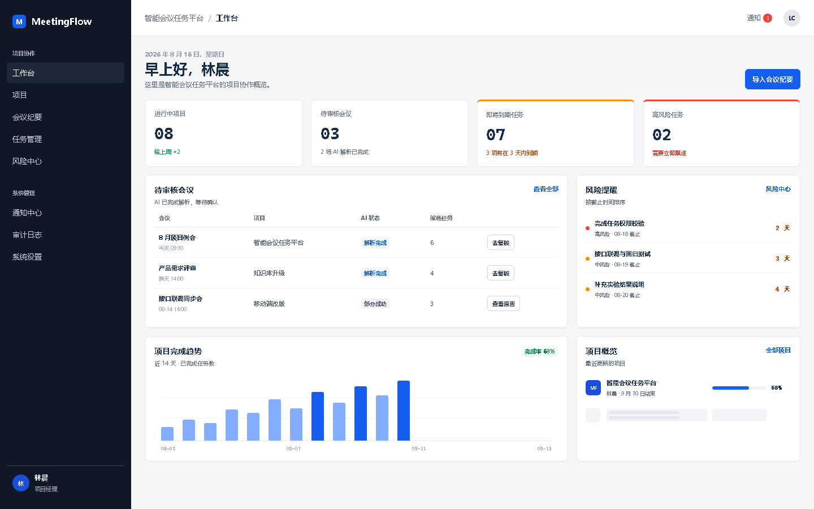 | 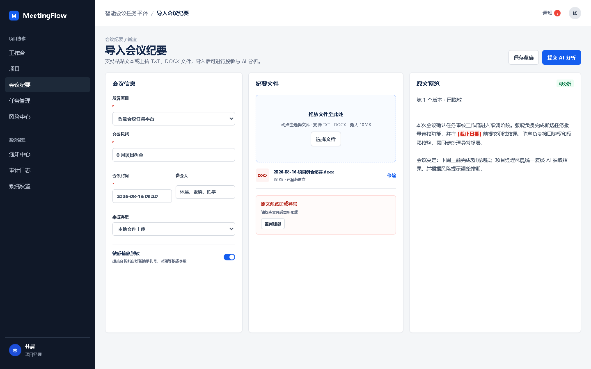 | 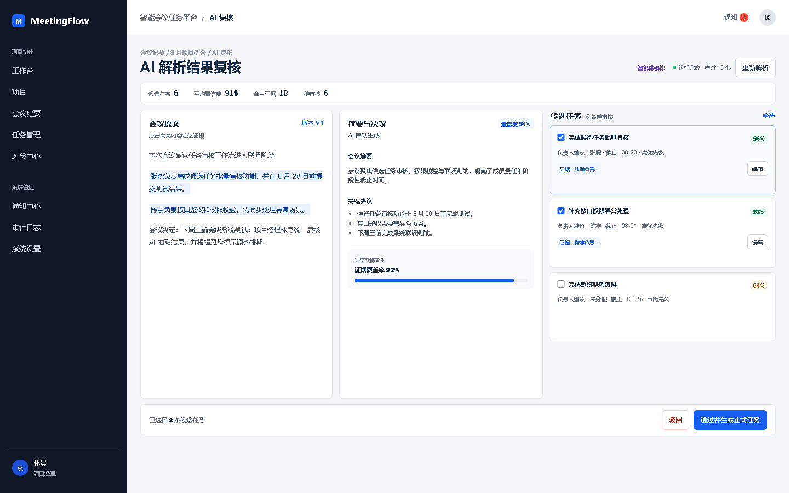 |

| 项目详情 | 任务看板 | 风险中心 |
| --- | --- | --- |
| 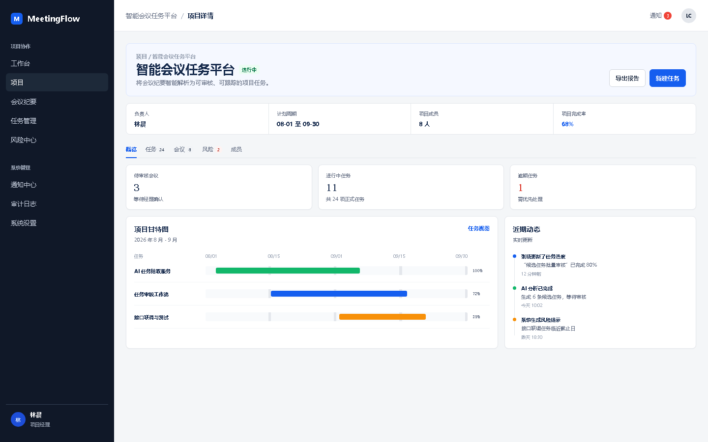 | 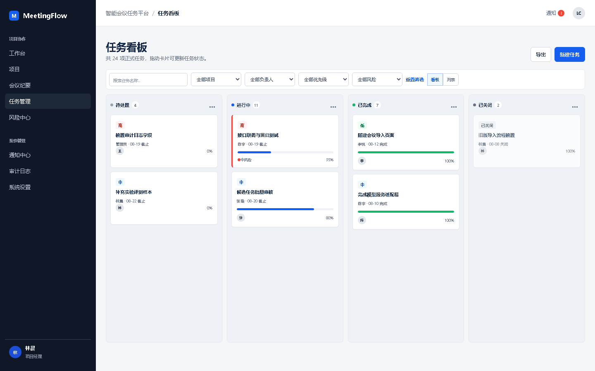 | 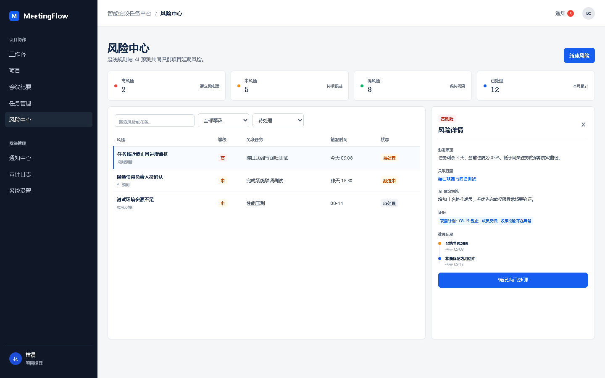 |

| 我的任务 | 工作反馈 | 系统设置 |
| --- | --- | --- |
| 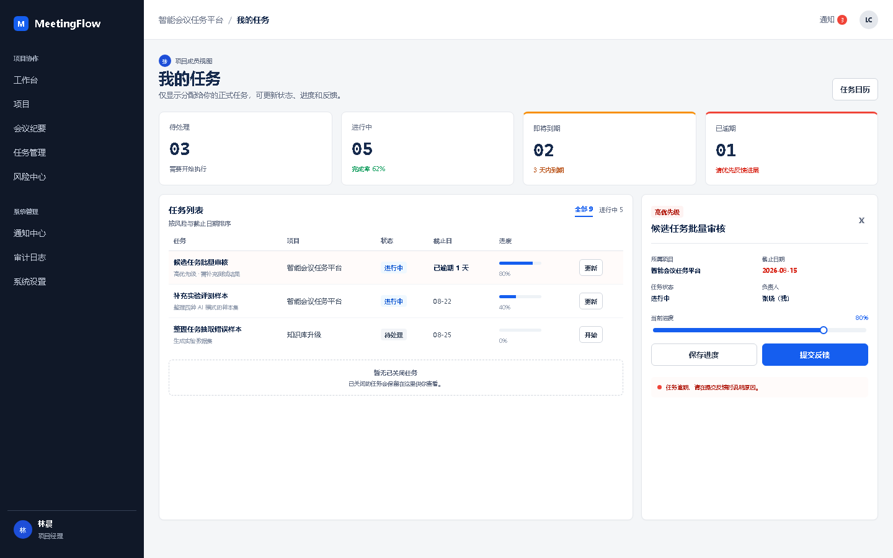 | 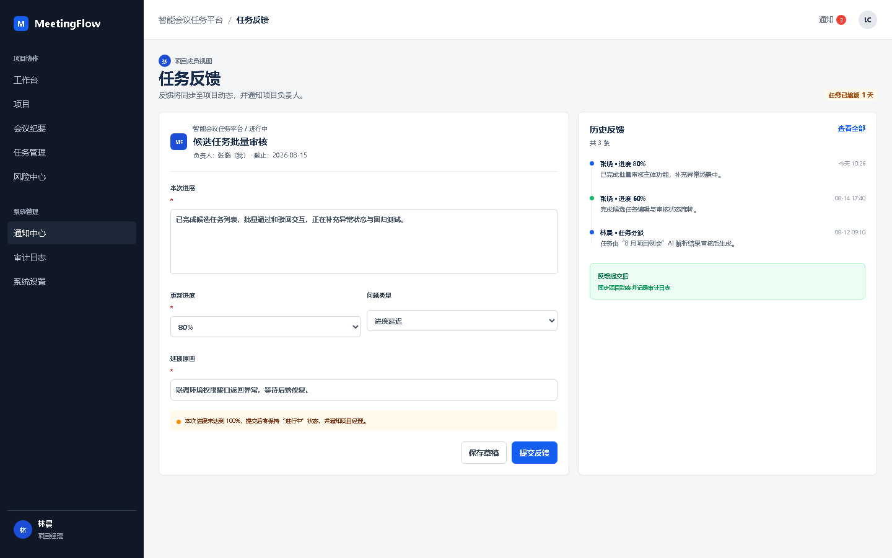 | 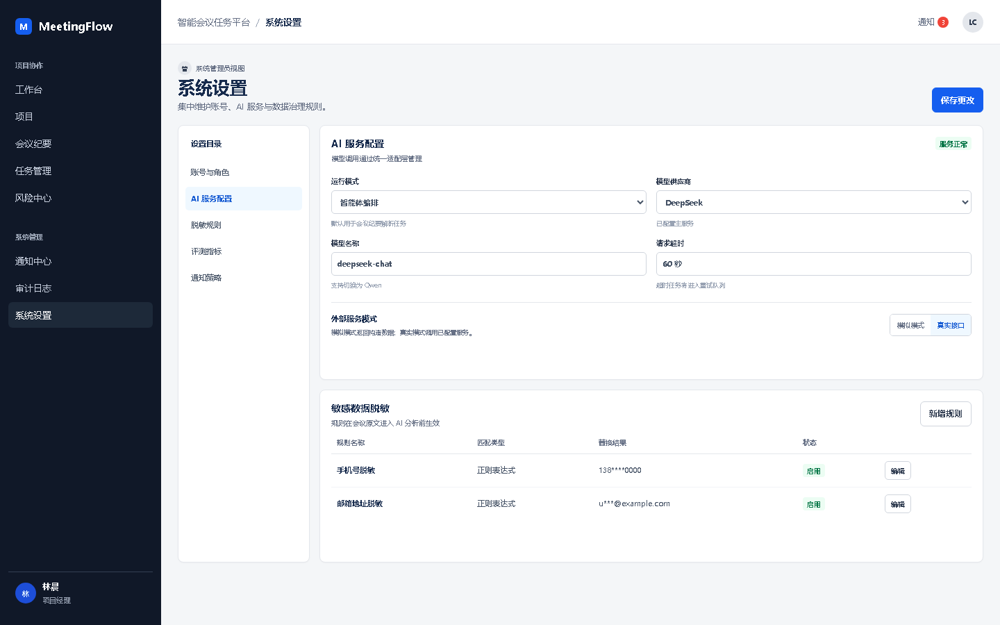 |

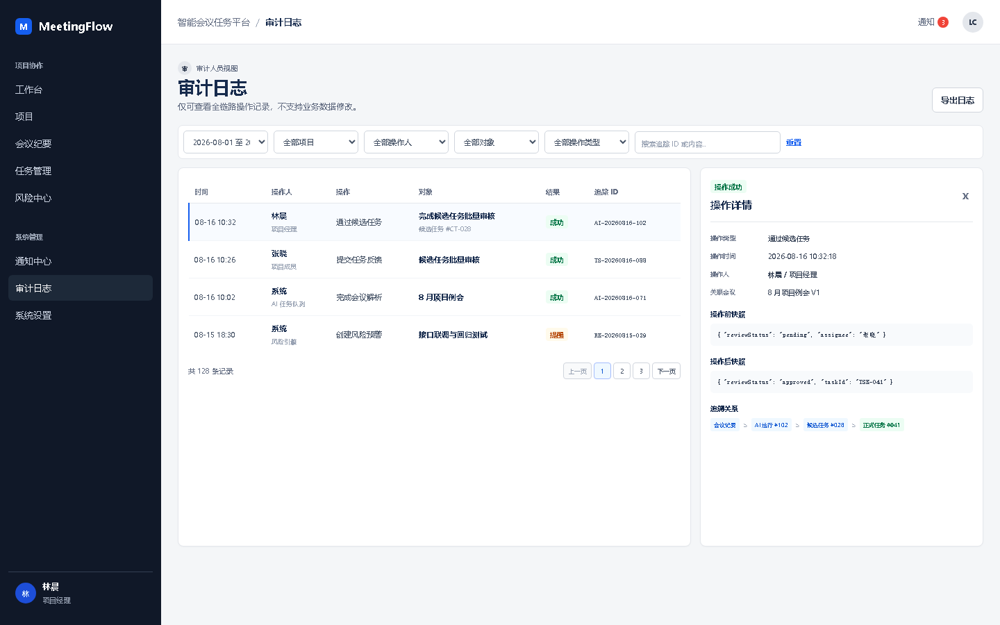

## AI 应用链路

### 从会议文本到结构化工作事项

1. **输入**：粘贴会议文字，或上传 TXT、DOCX 文件。
2. **预处理**：按系统设置对会议内容进行脱敏，并保留可查看、可恢复的版本记录。
3. **分析**：调用 AI 生成摘要，识别决定、候选任务和风险，并要求输出结构化结果。
4. **审核**：项目经理在审核队列中确认、修改或驳回候选结果。
5. **执行**：审核通过后生成正式任务和风险，支持负责人、优先级、截止时间、进度和反馈。
6. **跟踪**：系统通过逾期/临期提醒、实时更新和项目分析帮助团队持续跟进。

### 四种分析模式

| 模式 | 用途 | 关键行为 |
| --- | --- | --- |
| `manual` | 人工审核基线 | 不依赖模型，适合对照实验 |
| `llm` | 单轮大模型分析 | 快速生成摘要、决策、任务和风险候选 |
| `rag` | 检索增强分析 | 结合项目历史会议版本补充上下文 |
| `agent` | 计划式智能体分析 | 以可记录的步骤执行分析流程 |

实验中心记录运行次数、审核结果、耗时和模型调用次数。未配置 RAG 服务时，`rag` 表示当前无检索 RAG 基线，系统明确记录 `retrievalStatus=not_configured`，不会把未检索状态伪装成成功检索；配置完成后才会使用项目历史会议版本进行检索。

## 可验证的工程亮点

- **结构化 AI 输出**：将模型结果拆分为摘要、决策、候选任务和风险，进入审核队列后再写入业务数据。
- **RAG 与 Agent 可观测**：记录检索状态、分析模式、执行步骤和实验结果，便于比较不同策略。
- **数据安全边界**：会议版本先脱敏；向量库只索引脱敏内容，不保存会议原文。
- **权限与项目隔离**：按角色和项目成员关系限制数据访问，覆盖项目经理、项目成员、系统管理员和审计人员。
- **可追溯业务流**：会议版本、审核操作、任务变更、通知和权限操作均写入审计记录。
- **持续跟进能力**：任务状态、进度、工作反馈、截止时间、风险和提醒形成闭环，并支持实时更新。
- **可靠性设计**：Redis 用于缓存和可用性降级；检索失败会明确标记失败，不会静默降级为“已检索”。
- **结果可交付**：支持项目、任务和进度信息导出，便于团队同步和留档。

## 系统架构

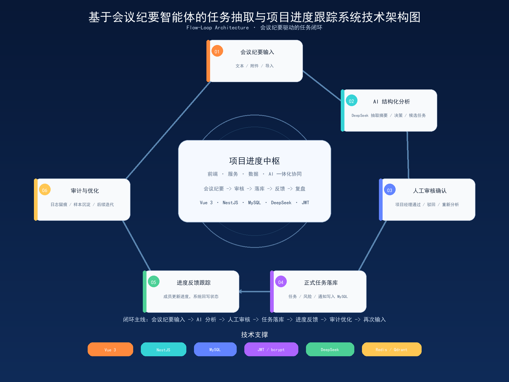

| 层次 | 技术与职责 |
| --- | --- |
| 前端 | Vue 3、TypeScript、Vite；项目、会议、任务、风险和分析视图 |
| 后端 | NestJS、TypeORM；认证、业务流程、权限和审计 |
| 数据层 | MySQL 持久化业务数据；Redis 提供缓存与降级 |
| AI 层 | DeepSeek API；摘要、决策、任务和风险抽取 |
| 检索层 | Qdrant + SiliconFlow Embedding（可选 RAG） |
| 实时通信 | Socket.IO 推送任务、提醒和进度变化 |

## 功能与角色

| 角色 | 主要操作 |
| --- | --- |
| 项目经理 | 管理项目、导入会议、审核 AI 结果、分派任务、处理风险 |
| 项目成员 | 查看参与项目，更新本人任务进度和工作反馈 |
| 系统管理员 | 管理账号、角色、系统运行设置和全局通知 |
| 审计人员 | 只读查看业务数据、通知和审计日志 |

系统按角色和项目成员关系隔离数据。密码重置后，原有登录令牌会立即失效。

## 本地运行

### 环境要求

- Node.js 20 或更高版本
- MySQL 8 或更高版本
- Docker Desktop（只有使用真实 RAG 时需要）

### 启动步骤

1. 安装依赖：

   ```bash
   npm ci
   ```

2. 创建本地配置文件：

   ```bash
   cp .env.example .env
   ```

   Windows PowerShell：

   ```powershell
   Copy-Item .env.example .env
   ```

   至少填写数据库密码和随机生成的 `JWT_SECRET`。需要真实 AI 分析时，再填写 `DEEPSEEK_API_KEY`。

3. 启动后端 API：

   ```bash
   npm run server
   ```

4. 另开终端启动前端：

   ```bash
   npm run dev
   ```

   浏览器打开 Vite 输出的本地地址，默认通常是 `http://127.0.0.1:5173`。

首次启动会自动执行幂等数据库迁移。请勿提交 `.env`，也不要把 API Key、密码或真实会议内容写入代码、日志和仓库。

## 可选：启用真实 RAG

启动本地 Qdrant：

```bash
docker compose up -d qdrant
```

然后在 `.env` 中配置：

```dotenv
SILICONFLOW_API_KEY=
SILICONFLOW_BASE_URL=https://api.siliconflow.cn/v1
EMBEDDING_MODEL=Qwen/Qwen3-Embedding-4B
QDRANT_URL=http://127.0.0.1:6333
```

系统只会索引脱敏后的会议版本。向量库中不保存会议原文；检索失败会明确标记为失败。

## 项目验证

```bash
# 运行全部自动化测试
npm test

# 类型检查
npx vue-tsc --noEmit --incremental false

# 生产构建
npm run build

# 核心业务闭环冒烟测试
npx tsx scripts/smoke-core-workflow.ts

# 项目闭环验收测试
npm run smoke:project-core-closure
```

冒烟测试需要连接当前配置的 MySQL，并会清理本次运行产生的临时数据。


## 项目资料

- Git 仓库地址：https://github.com/liufangyi52/graduation
- 产品需求、设计说明、原型图、测试脚本和验收材料位于 `docs/`、`scripts/` 和 `tests/` 目录。
