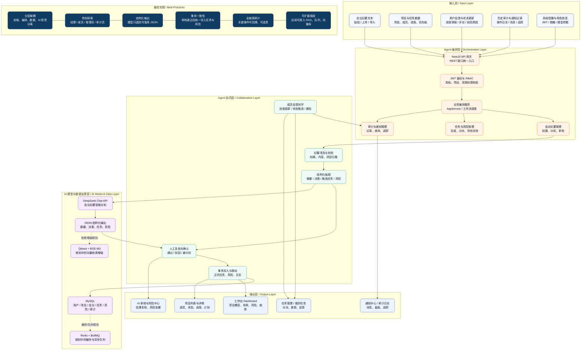

# 技术架构图

## 说明

这张图按当前项目真实实现整理：

1. 前端是 Vue 3 单页应用，负责工作台、项目、任务、会议纪要、AI 审核、风险和审计页面。
2. 后端是 NestJS 风格 API，统一做鉴权、权限控制和业务编排。
3. 会议纪要经 DeepSeek 分析后输出结构化 JSON，再由项目经理人工审核。
4. 审核通过后，系统在事务中写入正式任务和风险，并同步审计日志。
5. MySQL 是当前核心存储；Redis、BullMQ、Qdrant、RAG 是规划中的扩展能力。

